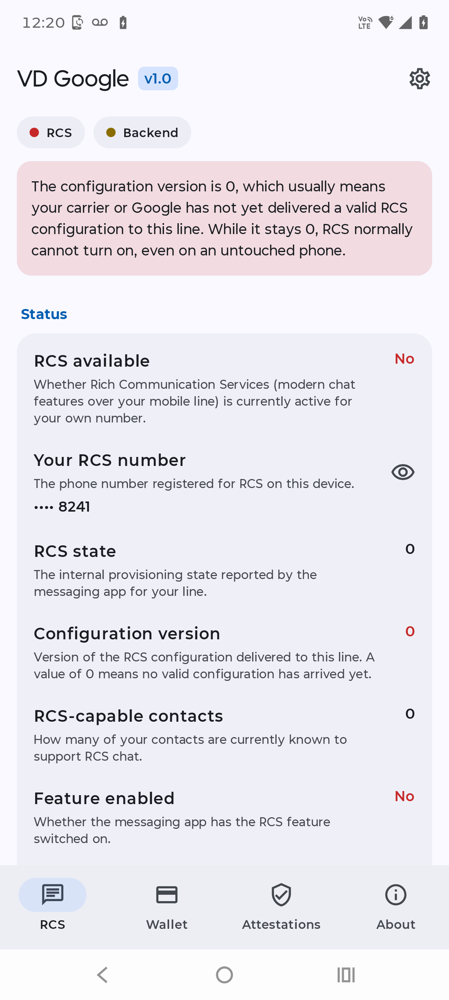
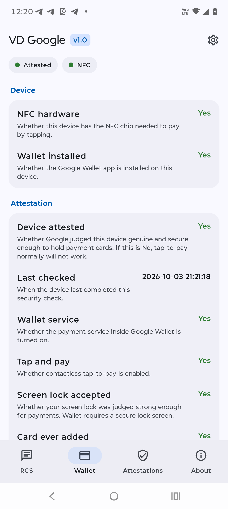
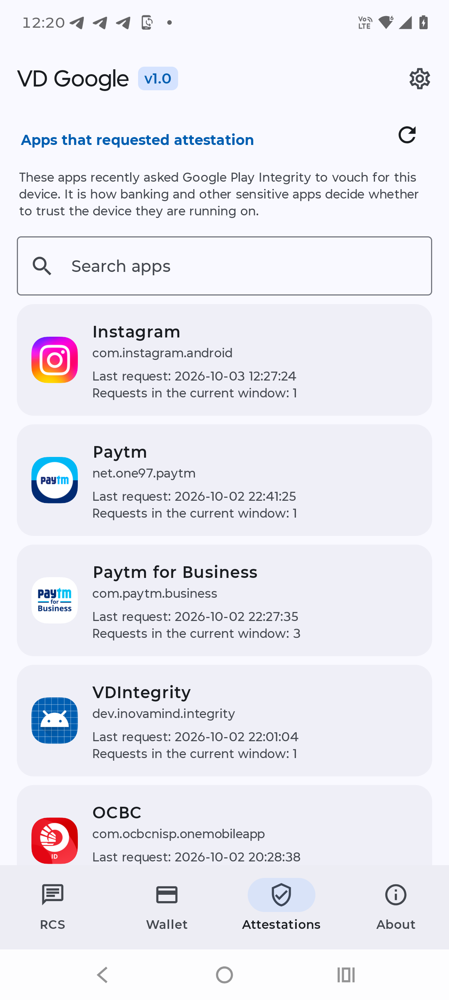
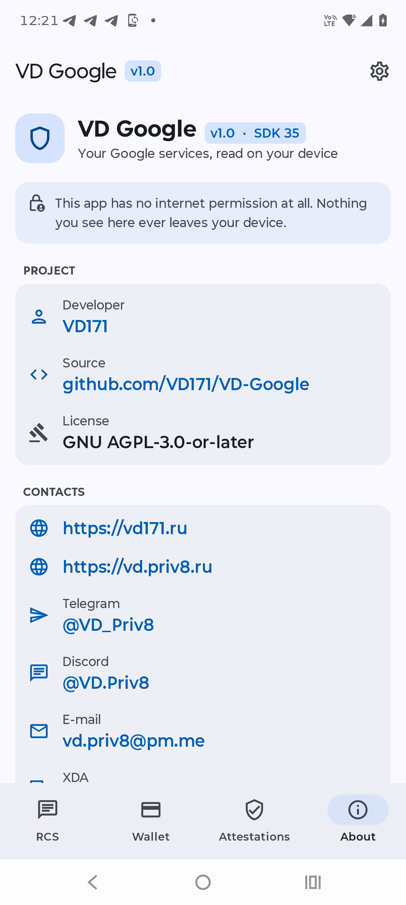

<!--
  VD GOOGLE - RCS, Google Wallet and Play Integrity attestations, read on-device.
  Copyright (C) 2026  VD171 - SPDX-License-Identifier: AGPL-3.0-or-later
-->

# VD Google

**Your Google services, read on your device. No internet, ever.**

VD Google shows you what Google itself records on your phone about three things, and explains what each item means, without sending anything anywhere.

> **Languages:** [English](README.md) · [العربية](README.ar.md) · [Čeština](README.cs.md) · [Deutsch](README.de.md) · [Español](README.es.md) · [فارسی](README.fa.md) · [Français](README.fr.md) · [हिन्दी](README.hi.md) · [Bahasa Indonesia](README.in.md) · [Italiano](README.it.md) · [日本語](README.ja.md) · [한국어](README.ko.md) · [Nederlands](README.nl.md) · [Polski](README.pl.md) · [Português](README.pt.md) · [Русский](README.ru.md) · [Svenska](README.sv.md) · [ไทย](README.th.md) · [Türkçe](README.tr.md) · [Tiếng Việt](README.vi.md) · [中文](README.zh.md)

   

## What it shows

### RCS
Whether RCS is available for your line, your RCS number, the RCS state, the configuration version, how many of your contacts support RCS, the carrier entitlement, presence (UCE), and the related timestamps (provisioning, sync, last message, token expiry, and more).

### Google Wallet
Whether your device is attested for payments, whether it has NFC hardware, whether Wallet is installed, the payment service and tap-to-pay state, whether your screen lock is accepted, and whether a card has ever been added.

### Attestations (Play Integrity)
The apps that recently asked Google Play Integrity to vouch for your device, each with its icon, its name, the full time of its last request, and how many requests it made in the current window.

Every item carries a short, plain-language explanation of what it really means.

## Privacy: no internet

VD Google declares **no permissions at all**, not even internet access. Nothing it reads ever leaves your device. You can confirm this in the manifest and in the source.

## Requirements

- Android 8.0 (API 26) or newer.
- **Root is required.** The information above lives in protected, system-only areas of Android. VD Google reads it with superuser access and does nothing else with it. Without root, the app only shows a screen explaining why root is needed.

## Timestamps

All times are shown in your device's current timezone, and the timezone is always labelled.

## Contacts

* https://vd171.ru
* https://vd.priv8.ru
* **Telegram:** @VD_Priv8 https://t.me/VD_Priv8
* **Discord:** @VD.Priv8 https://discord.com/users/1296831918989639721
* **E-mail:** vd.priv8@pm.me
* **XDA-Developers:** @VD171 https://xdaforums.com/m/vd171.4699873/
* **GitHub:** @VD171 https://github.com/VD171

## License

**GNU AGPL-3.0-or-later** - see [LICENSE](LICENSE). Copyleft, including the network clause: anyone who runs a modified version (even as a service) must offer its source. Chosen deliberately to keep forks open.

---

`android` `privacy` `security` `rcs` `google-wallet` `play-integrity` `attestation` `nfc` `tap-to-pay` `no-internet` `root` `kernelsu` `magisk` `lsposed` `on-device` `kotlin` `jetpack-compose` `material3` `vdgoogle`
